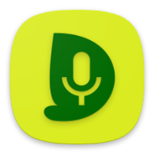

# Dicio assistant

Dicio is a *free and open source* **voice assistant** running on Android. It supports many different **skills** and input/output methods, and it provides both **speech** and **graphical** feedback to a question. It interprets user input and (when possible) generates user output entirely **on-device**, providing privacy by design. It has **multilanguage** support, and is currently available in these languages: Czech, Dutch, English, French, German, Greek, Italian, Polish, Russian, Slovenian, Spanish, Swedish, Turkish and Ukrainian. Open to contributions :-D

    
    &emsp;
    
    
    

## Screenshots

## Skills

Currently Dicio answers questions about:
- **search**: looks up information on **DuckDuckGo** (and in the future more engines) - _Search for Dicio_
- **weather**: collects weather information from **OpenWeatherMap** - _What's the weather like?_
- **lyrics**: shows **Genius** lyrics for songs - _What's the song that goes we will we will rock you?_
- **open**: opens an app on your device - _Open NewPipe_
- **calculator**: evaluates basic calculations - _What is four thousand and two times three minus a million divided by three hundred?_
- **telephone**: view and call contacts - _Call Tom_
- **timer**: set, query and cancel timers - _Set a timer for five minutes_
- **current time**: query current time - _What time is it?_
- **navigation**: opens the navigation app at the requested position - _Take me to New York, fifteenth avenue_
- **jokes**: tells you a joke - _Tell me a joke_
- **media**: play, pause, previous, next song
- **translation**: translate from/to any language with **Lingva** - _How do I say Football in German?_
- **wake word control**: turn on/off the wakeword - _Stop listening_
- **notifications**: reads all notifications currently in the status bar - _What are my notifications?_
- **flashlight**: turn on/off the phone flashlight - _Turn on the flashlight_

## Speech to text

Dicio uses [Vosk](https://github.com/alphacep/vosk-api/) as its speech to text (`STT`) engine. In order to be able to run on every phone small models are employed, weighing `~50MB`. The download from [here](https://alphacephei.com/vosk/models) starts automatically whenever needed, so the app language can be changed seamlessly.

## Wake Word

Dicio uses [OpenWakeWord](https://github.com/dscripka/openWakeWord) for wake word support, and by defaults it listens for the _Hey Dicio_ keyword. If you would like to use a different keyword, you can download other `.tflite` models from [Open Wake Word](https://github.com/dscripka/openWakeWord/releases/tag/v0.5.1) or from [this collection](https://github.com/fwartner/home-assistant-wakewords-collection). Then head to `Settings > Input and output methods > Import custom wake word` and select the `.tflite` model you downloaded. Alternatively, you can train a wake word model for a keyword of your choice by following this [Jupiter Notebook](https://github.com/dscripka/openWakeWord/blob/main/notebooks/automatic_model_training.ipynb) with this [configuration](meta/openwakeword_training_config.yml).

## Contributing

Dicio's code is **not only here**! The repository with the *compiler for sentences* language files is at [`dicio-sentences-compiler`](https://github.com/Stypox/dicio-sentences-compiler), the *number parser and formatter* is at [`dicio-numbers`](https://github.com/Stypox/dicio-numbers) and the code for evaluating matching algorithms is at [`dicio-evaluation`](https://github.com/Stypox/dicio-evaluation).

When contributing keep in mind that other people may have **needs** and **views different** than yours, so please *respect* them. For any question feel free to contact the project team at [@Stypox](https://github.com/Stypox).

### Matrix room for communication

The **#dicio** channel on *Matrix* is available to get in touch with the developers: [#dicio:matrix.org](https://matrix.to/#/#dicio:matrix.org). Some convenient Matrix clients, available both for phone and desktop, are listed at that link.

### Translating

If you want to translate Dicio to a new language, follow the **steps** listed in the documentation: https://dicio.stypox.org/translating.html

### Adding skills

If you want to add a new skill, or improve an existing one, check out the guide in the documentation: https://dicio.stypox.org/adding_skill.html
